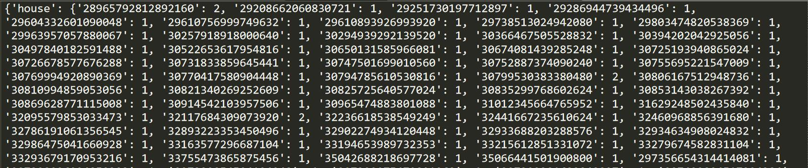
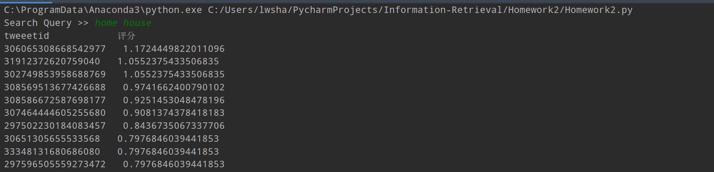

# 实验二 实验报告
## 姓名：单宝迪   学号：201700210069   班级：17数据

## 实验环境和实验时间

实验环境：
- 硬件环境:  Intel(R) Core(TM) i7-8550U  16GRAM
- 软件环境:  Windows 10 专业版 　Python3.7
- IDE: Pycharm 　Jupyter-Notebook

实验时间：

- 项目创建时间 2019.9.27
- 项目结束时间 2019.10.9
- 项目报告提交时间 2019.10.9

## 实验目标

- 在Homework1.1的基础上实现最基本的Ranked retrieval model
- Use SMART notation: lnc.ltn
- 改进Inverted index

## 实现过程

### 1.建立倒排索引

相比于Homework1.1,本次作业的倒排索引需要将doc，变为<docid, td>.因此，倒排索引在之前的基础上做了改进，实现源码如下:
```python
x = open('file/word.txt', 'w')
for line in f:
    word = TextBlob(line).words.singularize()
    word[0] = Word(word[0])
    # word[0]是 tweet id
    for i in word[1:]:
        # i=Word(i)
        if i not in Dict:
            #tmp={word[0]:1}
            Dict[i]={}
            Dict[i][word[0]] = 1
        else:
            if word[0] not in Dict[i]:
                Dict[i][word[0]] = 1
            else:
                Dict[i][word[0]]=Dict[i][word[0]]+1

# print(Dict['may'])
x.write(str(Dict))
x.close()
```
倒排索引结果示例如下:


### 2.计算每篇doc的cosine值

cosine的计算公式为：

$$c(cosine)=\frac{1}{\sqrt{w_1^2+w_2^2+\cdots+w_M^2}}$$


考虑到计算每个doc的cosine的计算量较大，如果再query时计算，对查询速度有影响，因此，我采用了一次计算出所有文本的cosine值导入文件的方法，process代码如下：
```python
S=open('file/cosinelog.txt','w')
Dict1 = {}
Cos={}
for line in f:
    word = TextBlob(line).words.singularize()
    word[0] = Word(word[0])
    # word[0]是 tweet id
    Dict1[word[0]] = {}
    for i in word[1:]:
        # i=Word(i)
        if i not in Dict1[word[0]]:
            Dict1[word[0]][i] = 1
        else:
            Dict1[word[0]][i] = Dict1[word[0]][i] + 1

for i in Dict1:
    ans = 0
    for word in Dict1[i]:
        tmp=1+math.log10(int(Dict1[i][word]))
        ans += tmp**2
    ans=math.sqrt(ans)
    print(ans)
    Cos[i]=ans

S.write(str(Cos))
```
### 3.计算结果

#### 3.1 计算wtq

考虑到查询方式为lnc,ltn,故需要对query中的词频求log，并乘以其idf。

计算公式为：

$$l(logarithm)=1+log(tf_{t,d})$$

$$t(idf)=log\frac{N}{df_t}$$


具体函数实现如下：
```python
def wtq(terms, term):
    global Dict
    num = 0
    for i in terms:
        if i == term:
            num += 1
    idf = math.log10(N / len(Dict[term]))
    wtq =  1 + math.log10(num)
    return idf * wtq
```

### 3.2 查询函数

对于doc中wtd的计算，由于计算量较小，我们将求log和除以length的过程整合到了search函数中。 Search函数的实现如下：

```python
def Search(terms):
    getDict()
    score = {}
    for w in terms:
        Wtq = wtq(terms, w)
        for i in Dict[w]:
            td = int(Dict[w][i])
            wtd = 1 + math.log10(td)
            if i not in score:
                score[i]=wtd*Wtq
            else:
                score[i]+=wtd*Wtq
    for doc in score:
        score[doc]=score[doc]/cos[doc]
    result = sorted(score.items(), key=lambda x: x[1], reverse=True)
    print("tweeetid            评分")
    for i in result[:10]:
        print(str(i[0])+"   "+str(i[1]))
```

## 运行示例




## 反思与感悟


通过本次实验，对于倒排索引的构建有了更充分的认识，对于*SMART notation*有了更深的了解。

------

*备注：Jupyter Notebook文件只是中间形式，实验结果以py文件为准。*