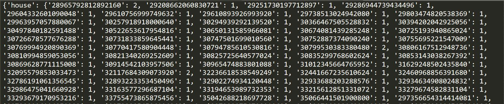

# 实验二 实验报告
## 姓名：单宝迪   学号：201700210069   班级：17数据

## 实验环境和实验时间

实验环境：
- 硬件环境:  Intel(R) Core(TM) i7-8550U  16GRAM
- 软件环境:  Windows 10 专业版 　Python3.7
- IDE: Pycharm 　Jupyter-Notebook

实验时间：

- 项目创建时间 2019.9.27
- 项目结束时间 2019.10.9
- 项目报告提交时间 2019.10.9

## 实验目标

- 在Homework1.1的基础上实现最基本的Ranked retrieval model
- Use SMART notation: lnc.ltn
- 改进Inverted index

## 实现过程

### 1.建立倒排索引

相比于Homework1.1,本次作业的倒排索引需要将doc，变为<docid, td>.因此，倒排索引在之前的基础上做了改进，实现源码如下:
```python
x = open('file/word.txt', 'w')
for line in f:
    word = TextBlob(line).words.singularize()
    word[0] = Word(word[0])
    # word[0]是 tweet id
    for i in word[1:]:
        # i=Word(i)
        if i not in Dict:
            #tmp={word[0]:1}
            Dict[i]={}
            Dict[i][word[0]] = 1
        else:
            if word[0] not in Dict[i]:
                Dict[i][word[0]] = 1
            else:
                Dict[i][word[0]]=Dict[i][word[0]]+1

# print(Dict['may'])
x.write(str(Dict))
x.close()
```
倒排索引结果示例如下:


### 2.计算每篇doc的cosine值

考虑到计算每个doc的cosine的计算量较大，如果再query时计算，对查询速度有影响，因此，我采用了一次计算出所有文本的cosine值导入文件的方法，process代码如下：
```python
S=open('file/cosinelog.txt','w')
Dict1 = {}
Cos={}
for line in f:
    word = TextBlob(line).words.singularize()
    word[0] = Word(word[0])
    # word[0]是 tweet id
    Dict1[word[0]] = {}
    for i in word[1:]:
        # i=Word(i)
        if i not in Dict1[word[0]]:
            Dict1[word[0]][i] = 1
        else:
            Dict1[word[0]][i] = Dict1[word[0]][i] + 1

for i in Dict1:
    ans = 0
    for word in Dict1[i]:
        tmp=1+math.log10(int(Dict1[i][word]))
        ans += tmp**2
    ans=math.sqrt(ans)
    print(ans)
    Cos[i]=ans

S.write(str(Cos))
```


备注：Jupyter Notebook文件只是中间形式，实验结果以py文件为准。